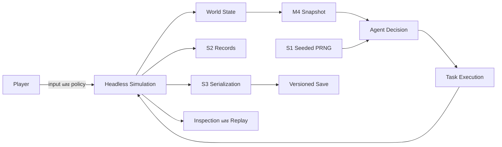

# แผนภาพบริบทสถาปัตยกรรม

แผนภาพนี้แสดงเฉพาะขอบเขตที่เอกสารต้นทางยืนยัน ได้แก่ ผู้เล่นส่ง input เข้าสู่ simulation, M4 Snapshot เป็นทางอ่าน world state สำหรับการตัดสินใจ, ระบบใช้ S1 เป็นแหล่งความสุ่ม และผลที่คงอยู่ผ่าน records กับ serialization

## ขอบเขตที่ต้องรักษา

- UI ไม่เป็นเจ้าของ authoritative state
- Agent ไม่อ่านสถานะภายในของ Agent อื่นผ่าน live reference
- ความสุ่มทั้งหมดของ simulation ผ่าน S1
- load ตรวจข้อมูลและไม่ซ่อมข้อมูลเงียบ ๆ
- การตัดสินใจสำคัญต้องตรวจสอบย้อนหลังได้

กลับไปที่ [[03-Architecture]] หรือดูความสัมพันธ์เอกสารใน [[Maps/dependency-matrix]]
