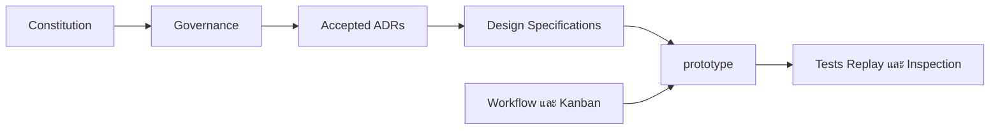

# ตารางความสัมพันธ์ของเอกสารและระบบ

## ลำดับ dependency ของเอกสาร

Design specifications กำหนดว่าระบบต้องทำอะไร ส่วน workflow กำหนดว่างานต้องดำเนินอย่างไร หากสองส่วนขัดกันและเอกสารไม่ได้ระบุวิธีตัดสิน ให้หยุดและรายงาน blocker

## ตารางจากเอกสารสู่ระบบ

| ประเด็น | เอกสารหลัก | ADR ที่เกี่ยวข้อง | ส่วน implementation |
|---|---|---|---|
| needs | `design/needs-system.md` | ADR-17 | `prototype/src/colonist/needs.ts` |
| traits | `design/personality-traits.md` | ADR-10 และ ADR-17 | `prototype/src/colonist/traits.ts` |
| memory | `design/memory-system.md` | ADR-16 | `prototype/src/colonist/memory.ts` |
| relationships | `design/colonist-agent-model.md` | ADR-12 และ ADR-20 | `prototype/src/colonist/relationships.ts` |
| decision loop | `design/decision-loop.md` | ADR-17 และ ADR-18 | `prototype/src/decision/decide.ts` |
| per-colonist runtime | `design/autonomous-three-colonist-runtime.md` | ADR-22 | `prototype/src/simulation/run.ts` |
| social offers | `design/social-offer-response-protocol.md` | ADR-18 และ ADR-21 | `prototype/src/task/socialOffers.ts` |
| Comfort | `design/comfort-assist-protocol.md` | ADR-24 | `prototype/src/simulation/comfortParticipation.ts` |
| tick order | `design/engineering-specification.md` §5 | Accepted architecture | `prototype/src/simulation/tick.ts` |
| save/load | `design/engineering-specification.md` §7 | ADR-20, ADR-22 และ ADR-24 | `prototype/src/core/serialization.ts` |
| replay | `design/engineering-specification.md` §8 | determinism obligations | `prototype/src/replay/replay.ts` |
| inspection | `design/engineering-specification.md` §9 | explainability obligations | `prototype/src/inspection/inspector.ts` |

ดูบริบทระบบที่ [[Maps/architecture-system-context]] และรายละเอียดโมดูลที่ [[05-Systems-and-Modules]]
