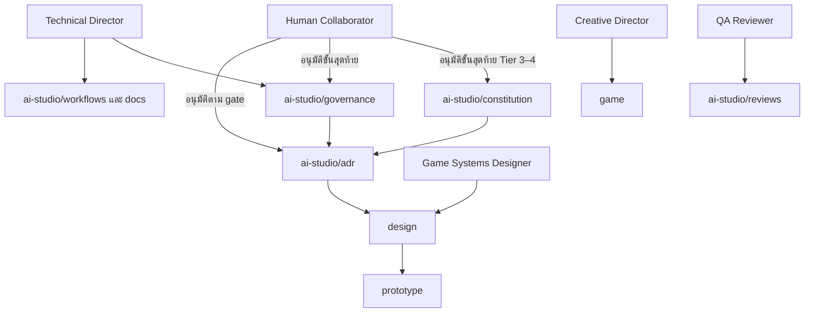

# แผนภาพอำนาจของไดเรกทอรี

## ตารางเจ้าของ

| ชุดเอกสาร | เจ้าของหลัก | ผู้อนุมัติขั้นสุดท้ายเมื่อกำหนด |
|---|---|---|
| `ai-studio/constitution/` | Creative Director และ Technical Director ตามไฟล์ | Human Collaborator |
| `ai-studio/governance/` | Technical Director | Human Collaborator |
| `ai-studio/workflows/` | Technical Director | Human Collaborator |
| `ai-studio/adr/` | ผู้เขียน ADR | Human Collaborator |
| `design/` | Game Systems Designer | Human Collaborator |
| `docs/` | Technical Director | Human Collaborator |
| `game/` | Creative Director | Human Collaborator |
| `ai-studio/reviews/` | QA Reviewer | เป็นบันทึก ไม่ใช่การตัดสินใจ |

Ownership ไม่ได้ห้ามผู้อื่นเสนอการแก้ไข แต่กำหนดผู้รับผิดชอบคุณภาพและผู้มีอำนาจอนุมัติ ดู workflow ที่ [[06-Development-Workflow]] และภาพรวมที่ [[01-Project-Overview]]
